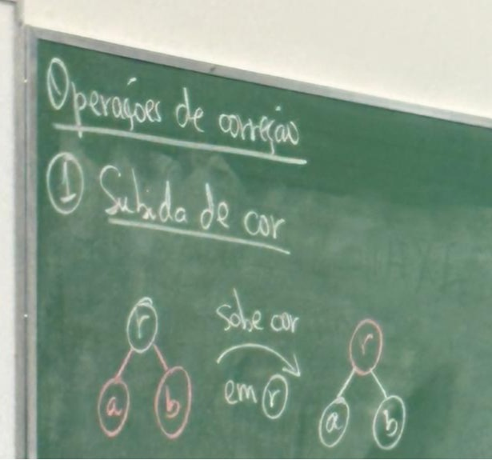
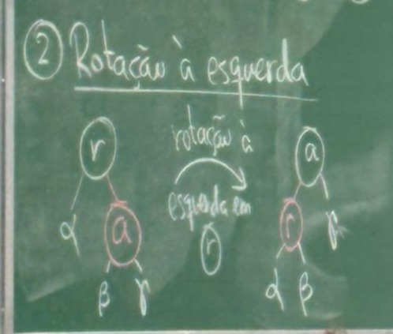
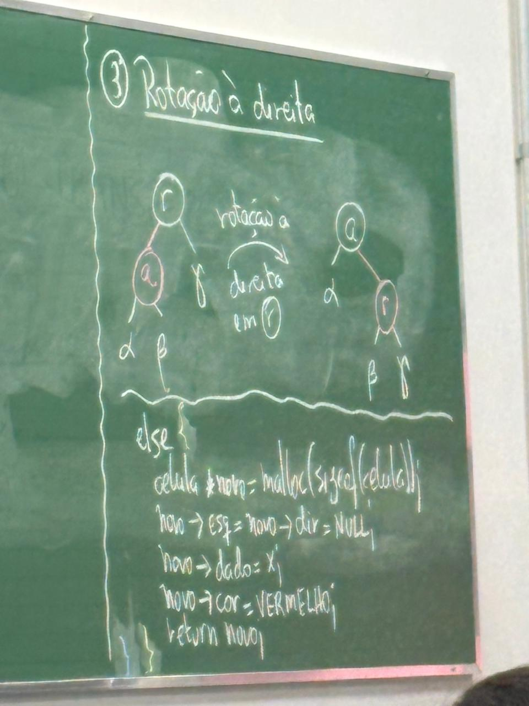

# Arvore Binaria de Busca Rubro Negra Esquerdista (Red Black)


É uma Arvore binária de busca ( ABB ) autobalanceável, ou seja, com garantia de altura logarítmica.<br> 
Há 5 regras de existência de uma ABB RNE:<br>
 - Todo nó é vermelho ou preto<br>
 - A raiz é preta<br>
 - As folhas são os NULLs e tem cor preta<br>
 - Se um nó é vermelho, então:<br> 
        -> seus filhos são pretos<br>
		-> é filho esquerdo<br>
- Para qualquer nó de uma ABB RNE, a quantidade de nós pretos a qualquer folha descendente é a mesma.<br>
		-> não se conta o próprio nó<br>
		-> essa propriedade chama-se altura negra do nó<br>
		
Considere bh a altura de uma ABB RNE<br>

1- Uma ABB RNE com altura negra bh tem, no mínimo, 2^bh - 1 nós.<br>
2- Se H é a altura da árvore, então: h/2 <= bh <= h portanto para uma ABB RNE qualquer com N nós:<br><br>
		n > (2^bh) - 1 >= (2^h/2) - 1 <br>
		2 ^h/2 <= n+1<br>
		log 2^h/2 < = log (n+1) então<br> h/2 <= log(n+1) <br> h < 2 log (n+1)<br>
        <br>
        Ou seja, a altura de uma ABB RNE é logarítmica


#### Inserção de um novo nó
Quando o nó novo é inserido ele é vermelho sempre

Condições para correção:<br>
- if (ehPreto (r->esq) && ehVerm(r->dir)) <br>
    - {rotação à esquerda em r} <br>
-  if (ehPreto(r) && ehVerm(r->esq) && ehVerm(r->esq->esq)) <br>
    - {rotação à direita em r} <br>
- if (ehPreto(r) && ehVerm(r->esq) && ehVerm(r->dir))<br>
    - {sobe a cor} <br>


##### Subida de cor



##### Rotação à esquerda


##### Rotação à direita



``` 
    celula *insere (celula *raiz, int x){
        raiz = *insere_abbrne(raiz, x);
        raiz->cor = PRETO;          // a raiz é preta indepentemente se em algum momento for vermelha por conta das correções, assim,
        return raiz;               // se em algum momento a operação sobe_cor for realizada na raiz, significa que a altura negra aumentou
    }


    celula *insere_abbrne (celula *raiz, int x){
        if (raiz != null){
            if (x < raiz->dado){
                raiz->esq = insere_abbrne(raiz->esq, x); 
            }
            else if (x > raiz-> dado){
                raiz->dir = insere_abbrne (raiz->dir, x);
            }
            if (ehPreto(raiz->esq) && ehVerm(raiz->dir)){
                raiz = rotação_a_esquerda(raiz);
            }
            if (ehPreto(raiz) && ehVerm(raiz->esq) && ehVerm(raiz -> esq -> esq)){
                raiz = rotacao_a_direita(raiz);
            }
            if (ehPreto(raiz) && ehVerm(raiz->esq) && ehVerm(raiz->dir)){
                sobe_cor(raiz);
            }
            return raiz; 
        }
        else{
            celula *novo = malloc(sizeof(celula));
            novo->esq = novo->dir = null;
            novo->dado = x;
            novo->cor = VERMELHO;
            return novo; 
        }


    celula *rotacao_a_esquerda(celula *raiz){
        celula *a = raiz->dir;
        a->cor = raiz->cor;
        raiz->cor = VERMELHO;
        celula *beta = a->esq;
        a->esq = raiz;
        raiz->dir = beta;
        return a;
    }

    void *sobe_cor(celula *raiz){
        raiz->cor = VERMELHO;
        raiz->esq->cor = raiz->dir->cor = PRETO;
    }

    celula *rotacao_a_direita(celula *raiz){
        celula *a = raiz->esq;
        a->cor = raiz->cor;
        raiz->cor = VERMELHO;
        celula *beta = a->dir;
        a->dir = raiz;
        raiz->esq = beta;
        return a;
    }
```
Obs: Todas as correções de uma ABB RNE custam O(1)


}
